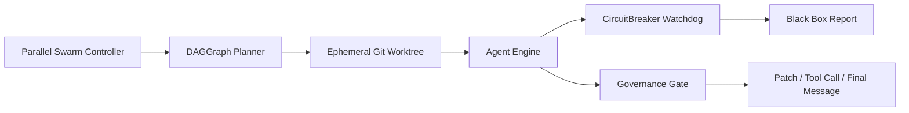

# jpscripts

[](https://www.python.org/downloads/)
[](https://github.com/psf/black)
[](https://mypy.readthedocs.io/)

**The modern, typed, "God-Mode" CLI for macOS power users with autonomous agent orchestration.**

For detailed workflows and God-Mode configurations, see the [Handbook](HANDBOOK.md).

## Highlights

- **Parallel Swarm Execution**: Run multiple AI agents in parallel using git worktrees for isolation
- **AST-Aware Context Slicing**: Smart code slicing that preserves semantic meaning
- **Constitutional Governance**: Automated enforcement of coding standards via AST analysis
- **Merge Conflict Resolution**: Intelligent 3-tier conflict resolution (TRIVIAL → SEMANTIC → COMPLEX)
- **CircuitBreaker Guardrails**: Enforces cost velocity and file churn limits, emitting Black Box crash reports before damage spreads
- **Cognitive Separation**: Captures raw `<thinking>` streams separately from action JSON so reasoning cannot be rewritten by summarization

## Architecture

The runtime moves from swarm planning into isolated work execution and finally agent control with hard-stop safety rails.



Swarm orchestration fans out tasks into dedicated worktrees, each agent engine runs with governance and the circuit breaker in-line so no response or tool invocation bypasses safety checks.

## God-Mode Capabilities

- **CircuitBreaker**: Monitors token-cost velocity and file churn every turn and halts execution with a Black Box crash report when thresholds are breached.
- **Cognitive Separation**: Splits `<thinking>` prose from JSON directives, validating the action payload independently and preserving unfiltered reasoning.

## Installation

### Prerequisites

- Python 3.12+ (uses `asyncio.TaskGroup` and modern type syntax)
- `brew install fzf ripgrep git`
- `brew install gh` (for PR helpers)
- `brew install zoxide` (for navigation)
- Optional: `brew install switchaudio-osx` (for audio control)

### Install with pipx

```bash
pipx install git+https://github.com/jpsweeney97/jp-scripts.git
```

### Development setup

```bash
git clone https://github.com/jpsweeney97/jp-scripts.git
cd jp-scripts
pip install -e ".[dev]"
# Install with AI memory support
pip install -e ".[ai]"
```

## Autonomous Evolution

`jp evolve` proactively identifies and refactors high technical debt code:

```bash
# Analyze without changes
jp evolve run --dry-run

# Run optimization (creates PR when successful)
jp evolve run --threshold 15

# Show complexity report
jp evolve report

# Show debt scores (complexity × fix frequency)
jp evolve debt
```

**How it works:**
1. Computes McCabe cyclomatic complexity for all Python files
2. Queries memory for fix frequency (files that often need fixes)
3. Calculates debt score: `Complexity × (1 + Fix_Frequency)`
4. Launches "Optimizer" agent to reduce complexity in the top file
5. Creates branch, applies changes, and **verifies tests before any push/PR** (Verify-before-Push guarantee)

All changes are validated against constitutional rules (AGENTS.md) and must pass `mypy --strict`.

## Parallel Swarm Architecture

Execute DAG-based tasks in parallel with full git worktree isolation:

```python
from jpscripts.core.dag import DAGGraph, DAGTask
from jpscripts.core.parallel_swarm import ParallelSwarmController

# Define tasks with dependencies
dag = DAGGraph(tasks=[
    DAGTask(id="task-001", objective="Add auth module", files_touched=["src/auth.py"]),
    DAGTask(id="task-002", objective="Add tests", files_touched=["tests/test_auth.py"]),
    DAGTask(id="task-003", objective="Update docs", depends_on=["task-001", "task-002"]),
])

# Execute with parallel workers
controller = ParallelSwarmController(
    objective="Implement authentication",
    config=config,
    repo_root=Path("."),
    max_parallel=4,
)
controller.set_dag(dag)
result = await controller.run()
```

**Key features:**
- Git worktree isolation prevents `index.lock` contention
- DAG validation ensures no cycles
- Automatic parallel grouping via `detect_disjoint_subgraphs()`
- Configurable `--preserve-on-failure` for debugging

## AST-Aware Context Slicing

Smart code slicing that preserves semantic relationships:

```python
from jpscripts.core.dependency_walker import DependencyWalker

walker = DependencyWalker(source_code)

# Get symbols and their relationships
symbols = walker.get_symbols()
call_graph = walker.get_call_graph()
hierarchy = walker.get_class_hierarchy()

# Slice code for a target symbol with dependencies
sliced = walker.slice_for_symbol("main")

# Fit within token budget
context = walker.slice_to_budget("process_data", max_tokens=1000)
```

**Integrated with TokenBudgetManager:**
```python
from jpscripts.core.tokens import TokenBudgetManager

manager = TokenBudgetManager(total_budget=4000)
content = manager.allocate_with_dependencies(
    priority=1,
    content=source,
    target_symbol="main",
)
```

## Config Reference

`jpscripts` loads configuration in this order: CLI flags → environment variables → config file (`~/.jpconfig` or `JPSCRIPTS_CONFIG`) → defaults. Run `jp init` to generate a starter file.

Example TOML:

```toml
editor = "code -w"                 # default editor
notes_dir = "~/Notes/quick-notes"  # daily notes location
workspace_root = "~/Projects"      # base for jp recent / proj
ignore_dirs = [".git", "node_modules", ".venv", "__pycache__", "dist", "build", ".idea", ".vscode"]
snapshots_dir = "~/snapshots"
log_level = "INFO"
default_model = "gpt-5.1-codex"
memory_store = "~/.jp_memory.jsonl"
memory_model = "all-MiniLM-L6-v2"
use_semantic_search = true
max_file_context_chars = 50000
max_command_output_chars = 20000
```

## CLI Reference

### CLI Commands
| Command | Args | Description |
| :--- | :--- | :--- |
| `agent` | prompt, --recent/-r, --diff, --run/-x, --full-auto/-y, --model/-m, --provider/-p, --loop, --max-retries, --keep-failed, --archive, --web | Delegate a task to an LLM agent. Supports multiple providers: - Anthropic Claude (claude-opus-4-5, claude-sonnet-4-5, etc.) - OpenAI GPT/o1 (gpt-4o, o1, etc.) - Codex CLI (default for backward compatibility) Examples: jp agent "Fix the failing test" --run "pytest tests/" jp agent "Explain this code" --model claude-opus-4-5 --provider anthropic jp fix "Debug the error" --run "python main.py" --loop |
| `audioswap` | --no-fzf | Switch audio output device using SwitchAudioSource. |
| `brew-explorer` | --query/-q, --no-fzf | Search brew formulas/casks and show info. |
| `cliphist` | --action/-a, --limit/-l, --no-fzf | Simple clipboard history backed by SQLite. |
| `com` | — | Display the available jp commands and their descriptions. |
| `config` | — | Show the active configuration and where it came from. |
| `config-fix` | — | Attempt to fix a broken configuration file using Codex. |
| `doctor` | --tool/-t | Inspect external dependencies in parallel. |
| `evolve run` | --dry-run, --model/-m, --threshold/-t | Autonomous code evolution: identify highest technical debt file, optimize via LLM, and create PR. Uses McCabe complexity × fix frequency scoring. |
| `evolve report` | --limit/-n | Show complexity report for the codebase (most complex files and functions). |
| `evolve debt` | --limit/-n | Show technical debt scores combining complexity and fix frequency. |
| `fix` | prompt, --recent/-r, --diff, --run/-x, --full-auto/-y, --model/-m, --provider/-p, --loop, --max-retries, --keep-failed, --archive, --web | Delegate a task to an LLM agent. Supports multiple providers: - Anthropic Claude (claude-opus-4-5, claude-sonnet-4-5, etc.) - OpenAI GPT/o1 (gpt-4o, o1, etc.) - Codex CLI (default for backward compatibility) Examples: jp agent "Fix the failing test" --run "pytest tests/" jp agent "Explain this code" --model claude-opus-4-5 --provider anthropic jp fix "Debug the error" --run "python main.py" --loop |
| `gbrowse` | --repo/-r, --target | Open the current repo/branch/commit on GitHub. |
| `git-branchcheck` | --repo/-r | List branches with upstream and ahead/behind counts. |
| `gpr` | --action/-a, --limit, --no-fzf | Interact with GitHub PRs via gh (Typed & Robust). |
| `gstage` | --repo/-r, --no-fzf | Interactively stage files. |
| `gundo-last` | --repo/-r, --hard | Safely undo the last commit. Works on local branches too. |
| `handbook verify-protocol` | --name/-n | Execute Handbook protocol commands for the given context. |
| `init` | --config-path, --install-hooks | Interactive initializer that writes the active config file. |
| `loggrep` | pattern, --path/-p, --no-fzf, --follow/-f | Friendly log search with optional follow mode. |
| `map` | --root/-r, --depth/-d | Generate a concise project structure map with top-level symbols. |
| `memory add` | content, --tag/-t | Add a memory entry. |
| `memory consolidate` | --model/-m, --threshold | Cluster similar memories and synthesize canonical truth entries. |
| `memory reindex` | --force/-f | — |
| `memory search` | query, --limit/-l | Search memory for relevant entries. |
| `memory vacuum` | — | Remove memory entries related to deleted files to maintain vector store hygiene. |
| `note` | --message/-m | Append to today's note or open it in the configured editor. |
| `note-search` | query, --no-fzf | Search notes with ripgrep and optionally fzf. |
| `port-kill` | port, --force/-f, --no-fzf | Find processes bound to a port and kill one. |
| `process-kill` | --name/-n, --port/-p, --force/-f, --no-fzf | Interactively select and kill a process. |
| `proj` | --no-fzf | Fuzzy-pick a project using zoxide + fzf and print the path. |
| `recent` | --root/-r, --limit/-l, --max-depth, --include-dirs, --files-only, --no-fzf | Fuzzy-jump to recently modified files or directories. |
| `repo-map` | --root/-r, --depth/-d | Generate a concise project structure map with top-level symbols. |
| `ripper` | pattern, --path/-p, --no-fzf, --context/-C | Interactive code search using ripgrep + fzf. |
| `serialize snapshot` | --output/-o, --format/-f | — |
| `ssh-open` | --host/-h, --no-fzf | Fuzzy-pick an SSH host from ~/.ssh/config and connect. |
| `standup` | --days/-d, --max-depth | Summarize recent commits across repos. |
| `standup-note` | --days/-d | Run standup and append its output to today's note. |
| `stashview` | --repo/-r, --action/-a, --no-fzf | Browse stash entries and apply/pop/drop one. |
| `status-all` | --root/-r, --max-depth | Summarize git status across repositories with a live-updating table. |
| `sync` | --root/-r, --max-depth | Parallel git fetch across all repositories. |
| `team swarm` | objective | Launch architect, engineer, and QA Codex agents in parallel. |
| `tmpserver` | --dir/-d, --port/-p | Start a simple HTTP server. |
| `todo-scan` | --path/-p, --types | Scan for TODO items and display a structured table. |
| `trace list` | --limit/-n | List recent execution traces. |
| `trace show` | trace_id, --watch/-w | Display detailed trace for a specific execution. |
| `update` | — | Update jpscripts in editable installs, or guide pipx users. |
| `version` | — | Print the jpscripts version. |
| `watch watch` | — | Run a God-Mode file watcher that triggers syntax checks and memory updates. |
| `web-snap` | url | Fetch a webpage, extract main content, and save as a YAML snapshot. |
| `whatpush` | --repo/-r, --max-commits | Show what will be pushed to the upstream branch. |

### MCP Tools
| Tool | Params | Description |
| :--- | :--- | :--- |
| `append_daily_note` | message: str | Append a log entry to the user's daily note system. |
| `apply_patch` | path: str, diff: str | Apply a unified diff to a file within the workspace. Args: path: Target file path, absolute or relative to the workspace root. diff: Unified diff content to apply. Returns: Status message describing whether the patch was applied. |
| `fetch_url_content` | url: str | Fetch and parse a webpage into clean Markdown. |
| `find_todos` | path: str='.' | Scan for TODO/FIXME/HACK comments in the codebase. Returns a JSON list of objects: {type, file, line, text}. |
| `get_git_status` | — | Return a summarized git status. |
| `get_workspace_status` | max_depth: int=2 | Summarize branch status for repositories in the workspace. Args: max_depth: Depth to search for git repositories under workspace_root. Returns: Formatted summary lines containing repo name, branch, and ahead/behind counts. |
| `git_commit` | message: str | Stage all changes and create a commit. |
| `kill_process` | pid: int, force: bool=False | Kill a process by PID. |
| `list_directory` | path: str | List contents of a directory (like ls). Returns a list of 'd: dir_name' and 'f: file_name'. |
| `list_processes` | name_filter: str | None=None, port_filter: int | None=None | List running processes. |
| `list_projects` | — | List known projects (via zoxide). |
| `list_recent_files` | limit: int=20 | List files modified recently in the current workspace root and surface related memories. |
| `read_file` | path: str | Read the content of a file (truncated to JP_MAX_FILE_CONTEXT_CHARS). Use this to inspect code, config files, or logs. |
| `read_file_paged` | path: str, offset: int=0, limit: int=20000 | Read a file segment starting at byte offset. Use this to read large files. |
| `recall` | query: str, limit: int=5 | Retrieve the most relevant memories for a query. |
| `remember` | fact: str, tags: str | None=None | Save a fact or lesson to the persistent memory store. Tags can be provided as a comma-separated list. |
| `run_shell` | command: str | Execute a safe, sandboxed command without shell interpolation. Only allows read-only inspection commands. |
| `run_tests` | target: str='.', verbose: bool=False | Run pytest on a specific target (directory or file) and return the results. Use this to verify fixes. |
| `search_codebase` | pattern: str, path: str='.' | Search the codebase using ripgrep (grep). Returns the raw text matches with line numbers. |
| `write_file` | path: str, content: str, overwrite: bool=False | Create or overwrite a file with the given content. Enforces workspace sandbox. Requires overwrite=True to replace existing files. |

## Troubleshooting

- `jp doctor` shows LanceDB/embedding failures: install AI extras (`pip install "jpscripts[ai]"`) or set `use_semantic_search = false` in `~/.jpconfig` if you want JSONL-only mode. Capability errors surface as `CapabilityMissingError` rather than silent degradation.
- `jp doctor` reports MCP config missing: ensure `~/.codex/config.toml` exists or pass `--tool mcp` after running `jp init` to regenerate the file; server discovery requires that config path.
