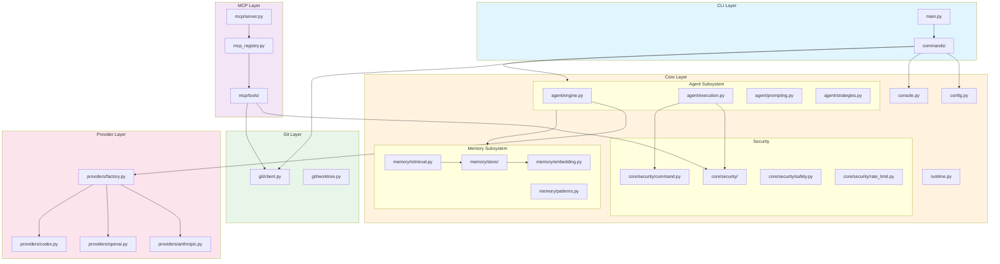
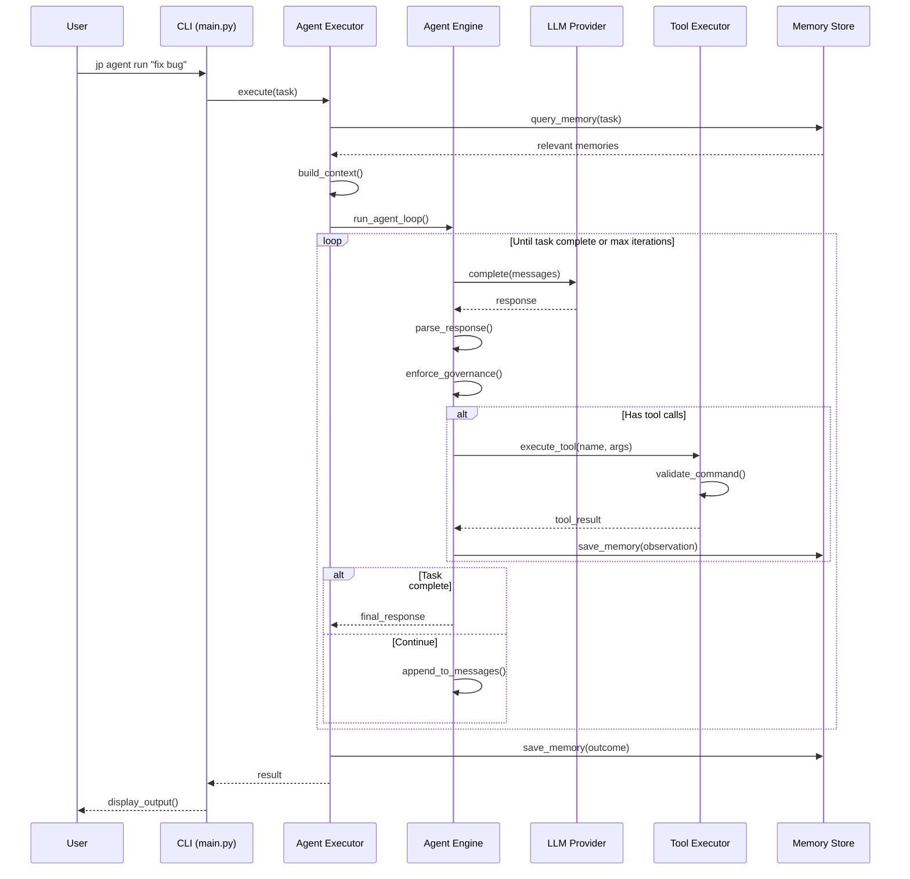
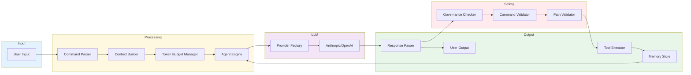
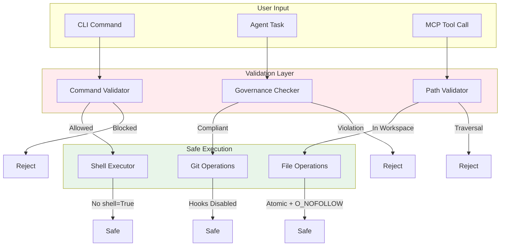

# jpscripts Architecture

This document describes the high-level architecture of jpscripts, including module interactions and data flow.

---

## Module Interaction Diagram



### Module Descriptions

| Module | Purpose |
|--------|---------|
| **main.py** | CLI entry point, dynamic command discovery |
| **commands/** | CLI command implementations (nav, agent, evolve, etc.) |
| **agent/** | Agent engine, middleware, parsing, execution loop |
| **memory/** | Persistent memory storage, embeddings, retrieval |
| **governance/** | AST checker, secret scanner, constitutional compliance |
| **core/security/** | Security package: path validation, command validation, rate limiting, safety |
| **core/security/path.py** | Path traversal prevention, TOCTOU-safe file operations |
| **core/security/command.py** | Shell command allowlist/blocklist |
| **core/security/safety.py** | Safe shell execution policies |
| **core/security/rate_limit.py** | Token bucket rate limiter |
| **git/** | Git operations via subprocess |
| **mcp/** | Model Context Protocol server and tools |
| **providers/** | LLM provider implementations |
| **swarm/** | Parallel execution with git worktree isolation |
| **ai/** | Token utilities, AI-specific helpers |

---

## Data Flow Diagram



---

## Request Flow Diagram



---

## Component Responsibilities

### CLI Layer
- **main.py**: Entry point, dynamic command discovery, help generation
- **commands/**: Individual CLI commands using Typer

### Agent Subsystem (`agent/`)
- **engine.py**: AgentEngine class, main orchestration
- **middleware.py**: Middleware pipeline (tracing, governance, circuit breaker)
- **parsing.py**: LLM response parsing, JSON extraction
- **circuit.py**: Circuit breaker, cost velocity tracking
- **governance.py**: Governance enforcement for agent responses
- **execution.py**: Main agent loop, repair strategies
- **prompting.py**: Prompt construction, context assembly

### Memory Subsystem (`memory/`)
- **store/**: Storage backend package with pluggable implementations
  - **jsonl.py**: JSONL file-based storage with keyword search
  - **lance.py**: LanceDB vector store with semantic search
  - **hybrid.py**: Combined storage with RRF fusion
- **embedding.py**: Sentence transformer embeddings
- **retrieval.py**: Semantic search, clustering
- **patterns.py**: Pattern extraction and synthesis

### Governance Subsystem (`governance/`)
- **ast_checker.py**: Constitutional AI checks, AST analysis
- **secret_scanner.py**: API key detection in code

### Core (`core/`)
- **security/**: Security package (consolidated from individual modules)
  - **path.py**: Path traversal prevention, atomic operations
  - **command.py**: Shell command allowlist/blocklist
  - **safety.py**: Safe shell execution policies
  - **rate_limit.py**: Token bucket rate limiter
- **runtime.py**: Context variables, circuit breaker state
- **config.py**: Application configuration
- **console.py**: Logging and output utilities

### Provider Layer
- **factory.py**: Provider selection based on model
- **anthropic.py**: Claude API integration
- **openai.py**: OpenAI/Azure integration
- **codex.py**: Codex CLI integration

---

## Key Design Patterns

### Result[T, E] Pattern
Error handling uses explicit Result types for recoverable errors:
```python
def load_config() -> Result[AppConfig, ConfigError]:
    ...
```

### Protocol-Based Abstractions
Core interfaces use Protocol types for flexibility:
```python
class MemoryStore(Protocol):
    def search(self, query: str, limit: int) -> list[MemoryEntry]: ...
```

### Lazy Loading
Heavy dependencies are loaded only when needed:
```python
def get_embedding_client():
    from sentence_transformers import SentenceTransformer  # Lazy
    ...
```

### Context Variables
Runtime state uses context variables for thread-safety:
```python
workspace_var: ContextVar[Path] = ContextVar("workspace")
```

---

## Security Architecture



### Security Controls

1. **Command Validation**: Allowlist/blocklist for shell commands
2. **Path Validation**: All paths checked against workspace root
3. **Governance Checking**: AST analysis for code safety
4. **Atomic Operations**: TOCTOU-safe file operations with O_NOFOLLOW
5. **Hook Disabling**: Git hooks disabled during automated operations
6. **Rate Limiting**: MCP tools have per-minute limits
7. **Secret Detection**: Pattern matching for API keys in code

---

## See Also

- [CONTRIBUTING.md](../CONTRIBUTING.md) - Development guide
- [HANDBOOK.md](../HANDBOOK.md) - Agent protocol reference
- [AGENTS.md](../AGENTS.md) - Agent personas
