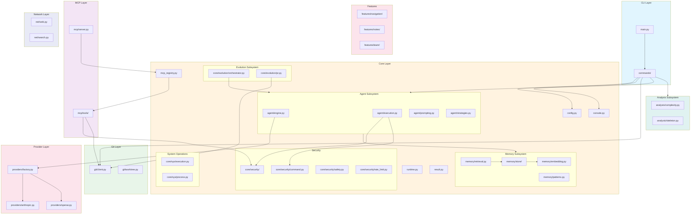

# jpscripts Architecture

This document describes the high-level architecture of jpscripts, including module interactions and data flow.

---

## Module Interaction Diagram



### Module Descriptions

| Module | Purpose |
|--------|---------|
| **main.py** | CLI entry point, dynamic command discovery |
| **commands/** | CLI command implementations (nav, agent, evolve, etc.) |
| **agent/** | Agent engine, middleware, parsing, execution loop |
| **memory/** | Persistent memory storage, embeddings, retrieval |
| **governance/** | AST checker, secret scanner, constitutional compliance |
| **core/** | Shared infrastructure (config, security, runtime, errors) |
| **core/security/** | Path validation, command validation, rate limiting, safety |
| **core/evolution/** | Code evolution orchestrator, PR generation |
| **core/sys/** | System operations (process, package, network, audio) |
| **git/** | Git operations via subprocess |
| **mcp/** | Model Context Protocol server and tools |
| **providers/** | LLM provider implementations |
| **swarm/** | Parallel execution with git worktree isolation |
| **ai/** | Token utilities, AI-specific helpers |
| **analysis/** | Static code analysis, complexity metrics, AST extraction |
| **capabilities/** | Capability registry for feature flags and tool availability |
| **features/** | Domain-specific features (navigation, notes, team) |
| **net/** | Network utilities (web scraping, search integration) |
| **structures/** | Data structures (DAG, etc.) |
| **ui/** | UI layer (agent UI components) |
| **templates/** | Template management and rendering |

---

## Data Flow Diagram


---

## Request Flow Diagram


---

## Component Responsibilities

### CLI Layer
- **main.py**: Entry point, dynamic command discovery, help generation
- **commands/**: Individual CLI commands using Typer

### Agent Subsystem (`agent/`)
- **engine.py**: AgentEngine class, main orchestration
- **execution.py**: Main agent loop, repair strategies
- **middleware.py**: Middleware pipeline (tracing, governance, circuit breaker)
- **parsing.py**: LLM response parsing, JSON extraction
- **circuit.py**: Circuit breaker, cost velocity tracking
- **governance.py**: Governance enforcement for agent responses
- **prompting.py**: Prompt construction, context assembly
- **archive.py**: Agent execution archive/history
- **context.py**: Execution context management
- **factory.py**: Agent factory, provider selection
- **models.py**: Type definitions for agent responses
- **ops.py**: Core operations (step, observe, act)
- **patching.py**: Code patching utilities
- **single_shot.py**: Single-shot agent execution
- **strategies.py**: Repair and recovery strategies
- **tools.py**: Agent tool definitions
- **tracing.py**: Request tracing and observability

### Memory Subsystem (`memory/`)
- **api.py**: Memory API interface
- **models.py**: Data models (MemoryEntry, SearchResult)
- **embedding.py**: Sentence transformer embeddings
- **retrieval.py**: Semantic search, clustering
- **patterns.py**: Pattern extraction and synthesis
- **store/**: Storage backend package with pluggable implementations
  - **jsonl.py**: JSONL file-based storage with keyword search
  - **lance.py**: LanceDB vector store with semantic search
  - **hybrid.py**: Combined storage with RRF fusion

### Governance Subsystem (`governance/`)
- **ast_checker.py**: Constitutional AI checks, AST analysis
- **secret_scanner.py**: API key detection in code
- **compliance.py**: High-level compliance scanning
- **config.py**: Safety rules configuration loader
- **diff_parser.py**: Diff analysis for pre-commit checks
- **types.py**: Violation type definitions

### Core (`core/`)
- **config.py**: Application configuration
- **console.py**: Logging and output utilities
- **runtime.py**: Context variables, circuit breaker state
- **result.py**: Result[T, E] type for error handling
- **errors.py**: Exception types (ConfigurationError, NetworkError)
- **context.py**: Execution context management
- **context_gatherer.py**: Gathers context for agent execution
- **cost_tracker.py**: Token and cost tracking
- **mcp_registry.py**: MCP server registry
- **error_middleware.py**: Error handling middleware
- **merge_resolver.py**: Git merge conflict resolution
- **command_validation.py**: CLI command validation
- **decorators.py**: Common decorators
- **diagnostics.py**: Diagnostic utilities
- **registry.py**: Tool and command registry
- **replay.py**: Execution replay
- **serializer.py**: Object serialization
- **templates.py**: Template rendering
- **rate_limit.py**: Token bucket rate limiter (legacy location)
- **safety.py**: Safe shell execution policies (legacy location)
- **security/**: Security package (consolidated)
  - **path.py**: Path traversal prevention, atomic operations
  - **command.py**: Shell command allowlist/blocklist
  - **safety.py**: Safe shell execution policies
  - **rate_limit.py**: Token bucket rate limiter
- **sys/**: System operations package
  - **execution.py**: Process execution
  - **package.py**: Package management
  - **network.py**: Network diagnostics
  - **process.py**: Process management
  - **audio.py**: Audio operations
- **evolution/**: Code evolution package
  - **orchestrator.py**: Evolution orchestration
  - **pr.py**: Pull request generation
  - **prompting.py**: Evolution prompting
  - **types.py**: Type definitions
  - **verification.py**: Solution verification

### Analysis Subsystem (`analysis/`)
- **complexity.py**: Code complexity metrics
- **skeleton.py**: AST skeleton extraction
- **dependency_walker.py**: Dependency graph traversal
- **structure.py**: Code structure analysis
- **cache.py**: Analysis result caching

### Features (`features/`)
- **navigation/**: Navigation feature service
- **notes/**: Notes feature service
- **team/**: Team feature models

### Network (`net/`)
- **web.py**: Web scraping and HTTP utilities
- **search.py**: Search engine integration

### Capabilities (`capabilities/`)
- **registry.py**: Capability registry implementation

### Structures (`structures/`)
- **dag.py**: Directed acyclic graph implementation

### UI (`ui/`)
- **agent_ui.py**: Agent UI components

### Provider Layer
- **factory.py**: Provider selection based on model, frozen ProviderConfig
- **anthropic.py**: Claude API integration
- **openai.py**: OpenAI/Azure integration

---

## Key Design Patterns

### Result[T, E] Pattern
Error handling uses explicit Result types for recoverable errors:
```python
def load_config() -> Result[AppConfig, ConfigError]:
    ...
```

### Protocol-Based Abstractions
Core interfaces use Protocol types for flexibility:
```python
class MemoryStore(Protocol):
    def search(self, query: str, limit: int) -> list[MemoryEntry]: ...
```

### Lazy Loading
Heavy dependencies are loaded only when needed:
```python
def get_embedding_client():
    from sentence_transformers import SentenceTransformer  # Lazy
    ...
```

### Context Variables
Runtime state uses context variables for thread-safety:
```python
workspace_var: ContextVar[Path] = ContextVar("workspace")
```

---

## Security Architecture


### Security Controls

1. **Command Validation**: Allowlist/blocklist for shell commands
2. **Path Validation**: All paths checked against workspace root
3. **Governance Checking**: AST analysis for code safety
4. **Atomic Operations**: TOCTOU-safe file operations with O_NOFOLLOW
5. **Hook Disabling**: Git hooks disabled during automated operations
6. **Rate Limiting**: MCP tools have per-minute limits
7. **Secret Detection**: Pattern matching for API keys in code

---

## See Also

- [CONTRIBUTING.md](../CONTRIBUTING.md) - Development guide
- [HANDBOOK.md](../HANDBOOK.md) - Agent protocol reference
- [AGENTS.md](../AGENTS.md) - Agent personas
